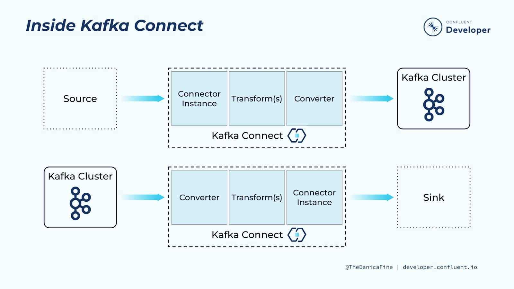

# Kafka Connect

## Introduction

 <center></center>

- Kafka Connect is used to stream data from sources into Kafka and out of Kafka to external sinks
- Confluent Cloud provides managed connectors, however custom connectors can be made by downloading the Confluent Platform and posting a custom connector.


## Setting Up Sink and Source

Project to create backups of Kafka messages. Idea is to store the topics into cold storage (blob) and stream back into a topic. The general direction is,

`Kafka topic -> sink connector -> Azure blob storage -> source connector -> backup Kafka topic`

### Related Links

[Connect Self-Managed Connect to Cloud](https://docs.confluent.io/cloud/current/cp-component/connect-cloud-config.html#standalone-cluster)

[Backup and Restore Azure Blob Storage Source Connector For Confluent Platform](https://docs.confluent.io/kafka-connectors/azure-blob-storage-source/current/backup-and-restore/overview.html#)

[Azure Blob Storage Sink Connector Config](https://docs.confluent.io/kafka-connectors/azure-blob-storage-sink/current/configuration_options.html#)

[Monitor Kafka Connect](https://docs.confluent.io/platform/current/connect/monitoring.html)


[Azure Blob Storage Source Connector Config](https://docs.confluent.io/kafka-connectors/azure-blob-storage-source/current/configuration.html)

## Connectors

### Cloud Connectors

 <center></center>

- Confluent Cloud provides pre-built and fully managed connectors that make it easy to install via the platform and web. 
- Instance of connector and execution is monitored
- Provides single message transformations (SMTs)

### Self Managed Connectors

<center></center>

- Connector can be managed on own cluster
- Requires a connect worker and connector
- Depending on load, more connector instances may need to be deployed
- Can be containerised and managed via Kubernetes

[Running a Self-Managed Kafka Connect Worker for Confluent Cloud](https://rmoff.net/2021/01/11/running-a-self-managed-kafka-connect-worker-for-confluent-cloud/)

### Kafka Connect Workers

Kafka Connect workers are just JVM processes (Java virtual machines) that can be deployed on bare metal or in containers.

Options:

- Run a bare metal, on premises install of Confluent Platform
- For infrastructure as a service, install Confluent Platform on those resources
- Terraform is an option on cloud providers
- Docker which can be used for on-prem and cloud-based installations

## Inside Kafka Connect

<center></center>

- Connector instance is responsible for interaction between Kafka Connect and external system. All of the classes that implement or used by a connector instance is defined in the connector plugin
- Converters handle serialisation and deserialisation of native data to bytes
- Transformers are optional, which can apply one or more transformations to data passing through the pipeline

## SMTs

Single Message Transformations can be used to cast a few fields before it is written to Kafka. In the example below, before the Datagen source connector's data is fed into Kafka messages, we can cast the fields of `orderid` and `orderunits` into the types that we want. In this case, we cast the `orderid` into a `String` and `orderunits` into `Int32`.

Additionally we wanted to format the timestamp. The format and target type of `yyyy-MM-dd` and `String` allows us to transform these fields.

<center></center>

In terms of managing your own connector, the properties related to transformations are shown below.

<center></center>

## Confluent Cloud Managed Connector API

The Confluent Cloud APIs allow us to manage our account and integrate Confluent into products via API REST calls and CLI.

Tutorial:

[Confluent Cloud API](https://developer.confluent.io/courses/kafka-connect/connect-api-hands-on/)

[Confluent CLI](https://developer.confluent.io/courses/kafka-connect/confluent-cli-hands-on/)

## Deployment of Self Managed Kafka Connector with Confluent Cloud

- [Set Up](#environment-set-up)
- [Running a Seld Managed Connector](#running-a-self-managed-connector)
- [Creating Kafka Connect Pipelines](#creating-kafka-connect-pipelines)
- [Clean Up](#clean-up)

### Environment Set Up
Exercise Environment Preparation Steps
Complete the following steps to set up the environment used for the course exercises. Prior to doing so, you will need to sign up for Confluent Cloud at https://confluent.cloud.

Run command:

```bash
cd ~ && \
curl -O http://packages.confluent.io/archive/7.1/confluent-7.1.1.tar.gz && \
tar xzf confluent-7.1.1.tar.gz && \
echo "export PATH=$HOME/confluent-7.1.1/bin/:$PATH" >> ~/.bashrc && \
export PATH=$HOME/confluent-7.1.1/bin/:$PATH
```

#### CCloud Library

Next, we will download a bash library of useful functions for interacting with Confluent Cloud. This library is community -supported and not supported by Confluent.

```bash
curl -sS -o ccloud_library.sh https://raw.githubusercontent.com/confluentinc/examples/latest/utils/ccloud_library.sh
```

Make ccloud_library.sh executable:

```bash
chmod +x ccloud_library.sh
```

#### Exercise Repo

```bash
git clone \
https://github.com/confluentinc/learn-kafka-courses.git \
~/learn-kafka-courses
```

#### Confluent Setup

```bash
confluent login --save
```

Set up the default environment.

```bash
confluent environment list
```

```bash
confluent environment use <default env ID>
```

#### Create and Set Default Confluent Cloud Cluster

```bash
confluent kafka cluster create kc-101 \
    --cloud gcp \
    --region us-west4 \
    --type basic
```

If cluster already exists we can get the information through,

```bash
confluent kafka cluster list
```

```bash
confluent kafka cluster use <cluster ID>
```

The confluent CLI needs to authenticate with Confluent Cloud using an API key and secret that has the required privileges for the cluster. Let’s create these now. The confluent CLI will automatically save them in ~/.confluent/config.json making them available for use by the CLI.

```bash
confluent api-key create  --resource <cluster ID>
```

Let’s now set this API key and secret as the default if it isn’t otherwise specified in confluent CLI commands.

```bash
confluent api-key use <cluster API key> --resource <cluster ID>
```

#### Enable Schema Registry

We also need to enable Schema Registry for our Confluent Cloud environment. Let’s do this now.

Note: If Schema Registry has already been enabled for the environment, the command will return the existing cluster details.

```bash
confluent schema-registry cluster enable --cloud gcp --geo us
```

The confluent CLI needs to also authenticate with the Schema Registry using an API key and secret. Let’s create these now. The confluent CLI will also automatically save them in ~/.confluent/config.json making them available for use by the CLI.

```bash
confluent api-key create  --resource <SR cluster ID>
```

#### Kafka Clients Using Cluster and Schema Registry

In addition to the confluent CLI, we will also be using Kafka clients that will need to authenticate with the cluster and Schema Registry using the API keys and secrets. We can create a client configuration file using the confluent CLI. The command will automatically obtain the cluster API key and secret from `~/.confluent/config.json` but we need to specify the SR API key and secret using the `--sr-apikey` and `--sr-apisecret` parameters.

[OUTDATED: Need to replace `--sr-apikey` with updated naming]
```bash 
confluent kafka client-config create java --sr-apikey <sr API key> --sr-apisecret <sr API secret> | tee $HOME/.confluent/java.config
```

Note: If tee isn’t present on your machine, you will need to create `.confluent/java.config` using some other method from the client config statements that are included in the command output.

#### Files Details

Required parameters for cluster API REST calls include the cluster API key and secret. 

* `java.config` - file that was created in the previous step contains the cluster API key and secret. 

* `ccloud_library.sh` - script auto-generates configuration files for downstream clients using as input the java.config file. 

* `delta_configs/env.delta` - One of the output files which contains commands that establish environment variables equal to the cluster.

Let’s generate these files now.

```bash
source ccloud_library.sh
ccloud::generate_configs $HOME/.confluent/java.config
```

And now we will establish the environment variables for our current command shell.

```bash
source delta_configs/env.delta
```

And finally, let’s verify the previous step was successful.

```bash
printenv
```

You should see in the command output the environment variables contained in env.delta have been established.

During this exercise we will be streaming data from a **MySQL** database running on the local machine in a **Docker container**. We’ll also be running local instances of **Elasticsearch** and **Neo4j** for use with sink connectors. The associated `docker-compose.yml` file is located in the `learn-kafka-courses/kafka-connect-101 `directory. We will now start this Docker container.

```bash
cd ~/learn-kafka-courses/kafka-connect-101 && \
cp self-managed-connect.yml docker-compose.yml && \
docker-compose up -d
```

This concludes the exercise environment preparation steps.

### Running a Self Managed Connector

#### Architecture

- **Self managed Kafka connector** that runs in **Docker** containers
- Configured to write to and read from Kafka topics in our kc-101 clusters

Data Pipelines:

- **Self managed Debezium MySQL Source connector** - stream data from local MySQL database into Kafka topic in Confluent Cloud
- **Self managed ElasticSearch Sink connector** - stream data from Kafka topic to local instance of ElasticSearch
- **Self managed Neo4j Sink connector** - stream data from Kafka topic in Confluent Cloud cluster to a local instance of Neo4j

#### Common Files

 - ***~/.confluent/java.config*** - Contains the required connection configs for the Kafka producer, consumer and admin with the server location, security protocol, username, password and scheme registry configs. **These are needed for the client to authenticate with Confluent Cloud.**

 ```yml
# Required connection configs for Kafka producer, consumer, and admin
bootstrap.servers=pkc-56d1g.eastus.azure.confluent.cloud:9092
security.protocol=SASL_SSL
sasl.jaas.config=org.apache.kafka.common.security.plain.PlainLoginModule required username='[username]' password='[password]';
sasl.mechanism=PLAIN
# Required for correctness in Apache Kafka clients prior to 2.6
client.dns.lookup=use_all_dns_ips

# Best practice for higher availability in Apache Kafka clients prior to 3.0
session.timeout.ms=45000

# Best practice for Kafka producer to prevent data loss 
acks=all

# Required connection configs for Confluent Cloud Schema Registry
schema.registry.url=https://psrc-4kk0p.westeurope.azure.confluent.cloud
basic.auth.credentials.source=USER_INFO
basic.auth.user.info=[user authentication]
 ```
***Bootstrap server*** - will return metadata to the client that consists of a list of all the brokers in the cluster. Then, when required, the client will know which exact broker to connect to to send or receive data, and accurately find which brokers contain the relevant topic-partition. **Endpoint for kc-101 cluster**.

- ***docker-compose.yml*** 

```yml
---
version: '2'
services:

  connect-1: #one of the two kafka connect worker nodes 
    image: confluentinc/cp-server-connect:7.1.1
    restart: always
    hostname: connect-1
    container_name: connect-1
    ports:
      - "8083:8083"
    volumes:
      - ./data:/data
    environment:
      CONNECT_BOOTSTRAP_SERVERS: $BOOTSTRAP_SERVERS #environment variable, endpoint for kc101 cluster
      CONNECT_GROUP_ID: "kc101-connect" #tells what connect cluster to join
      CONNECT_CONFIG_STORAGE_TOPIC: "_kc101-connect-configs" #internal topics to keep in sync with one another
      CONNECT_OFFSET_STORAGE_TOPIC: "_kc101-connect-offsets"
      CONNECT_STATUS_STORAGE_TOPIC: "_kc101-connect-status"
      CONNECT_REPLICATION_FACTOR: 3
      CONNECT_CONFIG_STORAGE_REPLICATION_FACTOR: 3
      CONNECT_OFFSET_STORAGE_REPLICATION_FACTOR: 3
      CONNECT_STATUS_STORAGE_REPLICATION_FACTOR: 3
      CONNECT_KEY_CONVERTER: "org.apache.kafka.connect.storage.StringConverter"

      # Confluent Schema Registry for Kafka Connect
      CONNECT_VALUE_CONVERTER: "io.confluent.connect.avro.AvroConverter"
      CONNECT_VALUE_CONVERTER_SCHEMAS_ENABLE: "true"
      CONNECT_VALUE_CONVERTER_SCHEMA_REGISTRY_URL: $SCHEMA_REGISTRY_URL
      CONNECT_VALUE_CONVERTER_BASIC_AUTH_CREDENTIALS_SOURCE: $BASIC_AUTH_CREDENTIALS_SOURCE
      CONNECT_VALUE_CONVERTER_SCHEMA_REGISTRY_BASIC_AUTH_USER_INFO: $SCHEMA_REGISTRY_BASIC_AUTH_USER_INFO

      CONNECT_REST_ADVERTISED_HOST_NAME: "connect-1"
      CONNECT_LISTENERS: http://connect-1:8083
      CONNECT_PLUGIN_PATH: "/usr/share/java,/usr/share/confluent-hub-components"
      CONNECT_LOG4J_APPENDER_STDOUT_LAYOUT_CONVERSIONPATTERN: "[%d] %p %X{connector.context}%m (%c:%L)%n"
      CONNECT_LOG4J_ROOT_LOGLEVEL: INFO
      CONNECT_LOG4J_LOGGERS: 'org.apache.kafka.connect.runtime.rest=WARN,org.reflections=ERROR'

      # Confluent Cloud config
      CONNECT_REQUEST_TIMEOUT_MS: "20000"
      CONNECT_RETRY_BACKOFF_MS: "500"
      CONNECT_SSL_ENDPOINT_IDENTIFICATION_ALGORITHM: "https"

      # Connect worker
      CONNECT_SECURITY_PROTOCOL: SASL_SSL
      CONNECT_SASL_JAAS_CONFIG: $SASL_JAAS_CONFIG
      CONNECT_SASL_MECHANISM: PLAIN

      # Connect producer
      CONNECT_PRODUCER_SECURITY_PROTOCOL: SASL_SSL
      CONNECT_PRODUCER_SASL_JAAS_CONFIG: $SASL_JAAS_CONFIG
      CONNECT_PRODUCER_SASL_MECHANISM: PLAIN

      # Connect consumer
      CONNECT_CONSUMER_SECURITY_PROTOCOL: SASL_SSL
      CONNECT_CONSUMER_SASL_JAAS_CONFIG: $SASL_JAAS_CONFIG
      CONNECT_CONSUMER_SASL_MECHANISM: PLAIN

    #installing connector plugins that will be used, downloaded from confluent hub
    command:
      - bash
      - -c
      - |
        echo "Installing Connector"
        confluent-hub install --no-prompt debezium/debezium-connector-mysql:1.7.1
        confluent-hub install --no-prompt confluentinc/kafka-connect-elasticsearch:11.1.8
        confluent-hub install --no-prompt neo4j/kafka-connect-neo4j:2.0.1
        confluent-hub install --no-prompt confluentinc/kafka-connect-jdbc:10.3.3
        #
        echo "Launching Kafka Connect worker"
        /etc/confluent/docker/run &
        #
        sleep infinity

  connect-2: #second node
    image: confluentinc/cp-server-connect:7.1.1
    restart: always
    hostname: connect-2
    container_name: connect-2
    ports:
      - "8084:8084"
    volumes:
      - ./data:/data
    environment:
      CONNECT_BOOTSTRAP_SERVERS: $BOOTSTRAP_SERVERS
      CONNECT_GROUP_ID: "kc101-connect"
      CONNECT_CONFIG_STORAGE_TOPIC: "_kc101-connect-configs"
      CONNECT_OFFSET_STORAGE_TOPIC: "_kc101-connect-offsets"
      CONNECT_STATUS_STORAGE_TOPIC: "_kc101-connect-status"
      CONNECT_REPLICATION_FACTOR: 3
      CONNECT_CONFIG_STORAGE_REPLICATION_FACTOR: 3
      CONNECT_OFFSET_STORAGE_REPLICATION_FACTOR: 3
      CONNECT_STATUS_STORAGE_REPLICATION_FACTOR: 3
      CONNECT_KEY_CONVERTER: "org.apache.kafka.connect.storage.StringConverter"

      # Confluent Schema Registry for Kafka Connect
      CONNECT_VALUE_CONVERTER: "io.confluent.connect.avro.AvroConverter"
      CONNECT_VALUE_CONVERTER_SCHEMAS_ENABLE: "true"
      CONNECT_VALUE_CONVERTER_SCHEMA_REGISTRY_URL: $SCHEMA_REGISTRY_URL
      CONNECT_VALUE_CONVERTER_BASIC_AUTH_CREDENTIALS_SOURCE: $BASIC_AUTH_CREDENTIALS_SOURCE
      CONNECT_VALUE_CONVERTER_SCHEMA_REGISTRY_BASIC_AUTH_USER_INFO: $SCHEMA_REGISTRY_BASIC_AUTH_USER_INFO

      CONNECT_REST_ADVERTISED_HOST_NAME: "connect-2"
      CONNECT_LISTENERS: http://connect-2:8084
      CONNECT_PLUGIN_PATH: "/usr/share/java,/usr/share/confluent-hub-components"
      CONNECT_LOG4J_APPENDER_STDOUT_LAYOUT_CONVERSIONPATTERN: "[%d] %p %X{connector.context}%m (%c:%L)%n"
      CONNECT_LOG4J_ROOT_LOGLEVEL: INFO
      CONNECT_LOG4J_LOGGERS: 'org.apache.kafka.connect.runtime.rest=WARN,org.reflections=ERROR'

      # Confluent Cloud config
      CONNECT_REQUEST_TIMEOUT_MS: "20000"
      CONNECT_RETRY_BACKOFF_MS: "500"
      CONNECT_SSL_ENDPOINT_IDENTIFICATION_ALGORITHM: "https"

      # Connect worker
      CONNECT_SECURITY_PROTOCOL: SASL_SSL
      CONNECT_SASL_JAAS_CONFIG: $SASL_JAAS_CONFIG
      CONNECT_SASL_MECHANISM: PLAIN

      # Connect producer
      CONNECT_PRODUCER_SECURITY_PROTOCOL: SASL_SSL
      CONNECT_PRODUCER_SASL_JAAS_CONFIG: $SASL_JAAS_CONFIG
      CONNECT_PRODUCER_SASL_MECHANISM: PLAIN

      # Connect consumer
      CONNECT_CONSUMER_SECURITY_PROTOCOL: SASL_SSL
      CONNECT_CONSUMER_SASL_JAAS_CONFIG: $SASL_JAAS_CONFIG
      CONNECT_CONSUMER_SASL_MECHANISM: PLAIN

    command:
      - bash
      - -c
      - |
        echo "Installing Connector"
        confluent-hub install --no-prompt debezium/debezium-connector-mysql:1.7.1
        confluent-hub install --no-prompt confluentinc/kafka-connect-elasticsearch:11.1.8
        confluent-hub install --no-prompt neo4j/kafka-connect-neo4j:2.0.1
        confluent-hub install --no-prompt confluentinc/kafka-connect-jdbc:10.3.3
        #
        echo "Launching Kafka Connect worker"
        /etc/confluent/docker/run &
        #
        sleep infinity

# Other systems
  mysql:
    # *-----------------------------*
    # To connect to the DB:
    #   docker exec -it mysql bash -c 'mysql -u root -p$MYSQL_ROOT_PASSWORD demo'
    # *-----------------------------*
    image: mysql:8.0
    container_name: mysql
    ports:
      - 3306:3306
    environment:
     - MYSQL_ROOT_PASSWORD=kc101
     - MYSQL_USER=mysqluser
     - MYSQL_PASSWORD=mysqlpw
    volumes:
     - ${PWD}/data/mysql:/docker-entrypoint-initdb.d
     - ${PWD}/data:/data

  elasticsearch:
    image: docker.elastic.co/elasticsearch/elasticsearch:7.17.0
    container_name: elasticsearch
    hostname: elasticsearch
    ports:
      - 9200:9200
    environment:
      xpack.security.enabled: "false"
      ES_JAVA_OPTS: "-Xms1g -Xmx1g"
      discovery.type: "single-node"

  neo4j:
    image: neo4j:4.4.4
    container_name: neo4j
    ports:
    - "7474:7474"
    - "7687:7687"
    environment:
      NEO4J_AUTH: neo4j/connect
      NEO4J_dbms_memory_heap_max__size: 2G
      NEO4J_dbms_memory_pagecache_size: 1G
      NEO4J_ACCEPT_LICENSE_AGREEMENT: 'yes'

```

#### Running the Kafka Connect Cluster and other Docker Containers

```bash
docker-compose up -d
```

By default, it will look for a `docker-compose.yml` file, otherwise you can specify a different file. A `Dockerfile` is used to build images while `docker-compose.yml` is used to run images. `-d` flag (detached) is to run containers in the background, allowing use of the terminal session.

```bash
docker-compose ps
```

Verifies the containers are running, or use Docker desktop to check that the containers are running.

Then to check that the Kafka Connect Workers are ready,

```bash
bash -c ' \
echo -e "\n\n=============\nWaiting for Kafka Connect to start listening on localhost ⏳\n=============\n"
while [ $(curl -s -o /dev/null -w %{http_code} http://localhost:8083/connectors) -ne 200 ] ; do
  echo -e "\t" $(date) " Kafka Connect listener HTTP state: " $(curl -s -o /dev/null -w %{http_code} http://localhost:8083/connectors) " (waiting for 200)"
  sleep 15
done
echo -e $(date) "\n\n--------------\n\o/ Kafka Connect is ready! Listener HTTP state: " $(curl -s -o /dev/null -w %{http_code} http://localhost:8083/connectors) "\n--------------\n"
'
```

To make sure that the ElasticSearch, Debezium and Neo4j connector plugins are available,

```bash
curl -s localhost:8083/connector-plugins | jq '.[].class'|egrep 'Neo4jSinkConnector|MySqlConnector|ElasticsearchSinkConnector'
```

### Creating Kafka Connect Pipelines

#### MySQL to Kafka Topic

The first step is to stream data from our local MySQL database to a Confluent Cloud Kafka Topic using Debezium MySQL Source Connector (converts information from existing databases into event streams).

To view the records that we will stream to a Kafka topic,

```bash
docker exec -t mysql bash -c 'echo "SELECT * FROM ORDERS ORDER BY CREATE_TS DESC LIMIT 10 \G" | mysql -u root -p$MYSQL_ROOT_PASSWORD demo'
```

Run the following to generate additional rows to the MySQL database.

```bash
docker exec mysql /data/02_populate_more_orders.sh
```

`docker exec` runs a specific command inside an already running container. 

```bash
docker exec [container name] [script or command]
```
To start the MySQL source connector instance,

```bash
curl -i -X PUT -H "Content-Type:application/json" \
    http://localhost:8083/connectors/source-debezium-orders-01/config \
    -d @debezium_mysql_config.json
```

where,

- `curl`: This is the command-line tool used to transfer data to or from a server. It supports various protocols, including HTTP, HTTPS, FTP, and more.

- `-i`: This option tells curl to include the HTTP response headers in the output. It's useful for debugging and understanding the context of the response from the server, including status codes that indicate whether the request was successful.

- `-X PUT`: This specifies the HTTP method to be used for the request. PUT is typically used for updating resources on the server. In this case, it's used to update the configuration of a Kafka Connect connector.

- `-H "Content-Type:application/json"`: This option adds an HTTP header to the request (-H) indicating the type of the data being sent. "Content-Type:application/json" tells the server that the data in the request body is in JSON format.

- `http://localhost:8083/connectors/source-debezium-orders-01/config`: This is the URL where the request is sent. It specifies the Kafka Connect server running on localhost (the local machine) on port 8083. The path /connectors/source-debezium-orders-01/config targets the configuration endpoint for a connector named source-debezium-orders-01. This URL is used to send configuration data to Kafka Connect for creating or updating the specified connector.

- `-d @debezium_mysql_config.json`: This part of the command includes data to be sent with the request. -d specifies that the following argument is the data to be sent. The @ symbol indicates that the data should be read from a file named debezium_mysql_config.json. This file contains the JSON-formatted configuration for the connector. Essentially, you're telling curl to send the contents of debezium_mysql_config.json as the request body.

where the `debezium_mysql_config.json` file contains,

```json
{
    "connector.class": "io.debezium.connector.mysql.MySqlConnector",
    "value.converter": "io.confluent.connect.json.JsonSchemaConverter",
    "value.converter.schemas.enable": "true",
    "value.converter.schema.registry.url": "${SCHEMA_REGISTRY_URL}",
    "value.converter.basic.auth.credentials.source": "${BASIC_AUTH_CREDENTIALS_SOURCE}",
    "value.converter.basic.auth.user.info": "${SCHEMA_REGISTRY_BASIC_AUTH_USER_INFO}",
    "database.hostname": "mysql",
    "database.port": "3306",
    "database.user": "kc101user",
    "database.password": "kc101pw",
    "database.server.id": "42",
    "database.server.name": "asgard",
    "table.whitelist": "demo.orders",
    "database.history.kafka.bootstrap.servers": "${BOOTSTRAP_SERVERS}",
    "database.history.consumer.security.protocol": "SASL_SSL",
    "database.history.consumer.sasl.mechanism": "PLAIN",
    "database.history.consumer.sasl.jaas.config": "org.apache.kafka.common.security.plain.PlainLoginModule required username=\"${CLOUD_KEY}\" password=\"${CLOUD_SECRET}\";",
    "database.history.producer.security.protocol": "SASL_SSL",
    "database.history.producer.sasl.mechanism": "PLAIN",
    "database.history.producer.sasl.jaas.config": "org.apache.kafka.common.security.plain.PlainLoginModule required username=\"${CLOUD_KEY}\" password=\"${CLOUD_SECRET}\";",
    "database.history.kafka.topic": "dbhistory.demo",
    "topic.creation.default.replication.factor": "3",
    "topic.creation.default.partitions": "3",
    "decimal.handling.mode": "double",
    "include.schema.changes": "true",
    "transforms": "unwrap,addTopicPrefix",
    "transforms.unwrap.type": "io.debezium.transforms.ExtractNewRecordState",
    "transforms.addTopicPrefix.type": "org.apache.kafka.connect.transforms.RegexRouter",
    "transforms.addTopicPrefix.regex": "(.*)",
    "transforms.addTopicPrefix.replacement": "mysql-debezium-$1"
}
```

To check the status of this connector instance,

```bash
curl -s "http://localhost:8083/connectors?expand=info&expand=status" | \
       jq '. | to_entries[] | [ .value.info.type, .key, .value.status.connector.state,.value.status.tasks[].state,.value.info.config."connector.class"]|join(":|:")' | \
       column -s : -t| sed 's/\"//g'| sort
```

### Kafka to ElasticSearch

To start an ElasticSearch sink connector instance,

```bash
curl -i -X PUT -H  "Content-Type:application/json" \
    http://localhost:8083/connectors/sink-elastic-orders-01/config \
    -d @elastic_sink_config.json
```

with the file `elastic_sink_config.json`,

```json
{
    "connector.class": "io.confluent.connect.elasticsearch.ElasticsearchSinkConnector",
    "value.converter": "io.confluent.connect.json.JsonSchemaConverter",
    "value.converter.schemas.enable": "true",
    "value.converter.schema.registry.url": "'$SCHEMA_REGISTRY_URL'",
    "value.converter.basic.auth.credentials.source": "'$BASIC_AUTH_CREDENTIALS_SOURCE'",
    "value.converter.basic.auth.user.info": "'$SCHEMA_REGISTRY_BASIC_AUTH_USER_INFO'",
    "topics": "mysql-debezium-asgard.demo.ORDERS",
    "connection.url": "http://elasticsearch:9200",
    "key.ignore": "true",
    "schema.ignore": "true",
    "tasks.max": "2"
}
```

Status monitor,

```bash
curl -s "http://localhost:8083/connectors?expand=info&expand=status" | \
       jq '. | to_entries[] | [ .value.info.type, .key, .value.status.connector.state,.value.status.tasks[].state,.value.info.config."connector.class"]|join(":|:")' | \
       column -s : -t| sed 's/\"//g'| sort | grep ElasticsearchSinkConnector
```

Inspection of data,

```bash
curl -s http://localhost:9200/mysql-debezium-asgard.demo.orders/_search \
    -H 'content-type: application/json' \
    -d '{ "size": 5, "sort": [ { "CREATE_TS": { "order": "desc" } } ] }' |\
    jq '.hits.hits[]._source | .id, .CREATE_TS'
```

### Kafka to Neo4j (analytics)

```bash
curl -i -X PUT -H  "Content-Type:application/json" \
    http://localhost:8083/connectors/sink-neo4j-orders-01/config \
    -d @neo4j_sink_config.json
```

```json
{
    "connector.class": "streams.kafka.connect.sink.Neo4jSinkConnector",
    "value.converter": "io.confluent.connect.json.JsonSchemaConverter",
    "value.converter.schemas.enable": "true",
    "value.converter.schema.registry.url": "'$SCHEMA_REGISTRY_URL'",
    "value.converter.basic.auth.credentials.source": "'$BASIC_AUTH_CREDENTIALS_SOURCE'",
    "value.converter.basic.auth.user.info": "'$SCHEMA_REGISTRY_BASIC_AUTH_USER_INFO'",
    "topics": "mysql-debezium-asgard.demo.ORDERS",
    "tasks.max": "2",
    "neo4j.server.uri": "bolt://neo4j:7687",
    "neo4j.authentication.basic.username": "neo4j",
    "neo4j.authentication.basic.password": "connect",
    "neo4j.topic.cypher.mysql-debezium-asgard.demo.ORDERS": "MERGE (city:city{city: event.delivery_city}) MERGE (customer:customer{id: event.customer_id, delivery_address: event.delivery_address, delivery_city: event.delivery_city, delivery_company: event.delivery_company}) MERGE (vehicle:vehicle{make: event.make, model:event.model}) MERGE (city)<-[:LIVES_IN]-(customer)-[:BOUGHT{order_total_usd:event.order_total_usd,order_id:event.id}]->(vehicle)"
}
```

```bash
curl -s "http://localhost:8083/connectors?expand=info&expand=status" | \
       jq '. | to_entries[] | [ .value.info.type, .key, .value.status.connector.state,.value.status.tasks[].state,.value.info.config."connector.class"]|join(":|:")' | \
       column -s : -t| sed 's/\"//g'| sort | grep Neo4jSinkConnector
```

### Clean Up

```bash
docker-compose down -v
```

```bash
confluent kafka cluster list
confluent kafka cluster use <kc-101 cluster ID>
confluent kafka topic list
confluent kafka topic delete <topic>
```

## Kafka Connect REST API

In order to manage connectors through the CLI, you can hit the Kafka Connect REST API through various commands,

https://developer.confluent.io/courses/kafka-connect/rest-api/

##