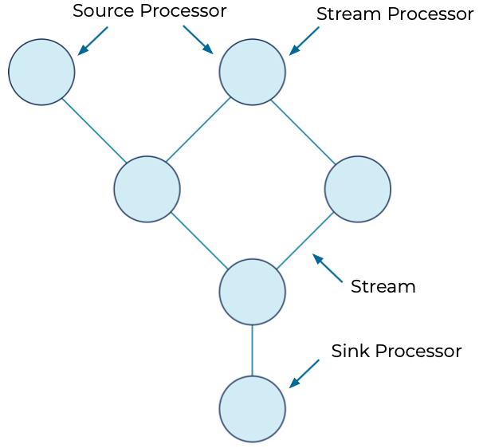
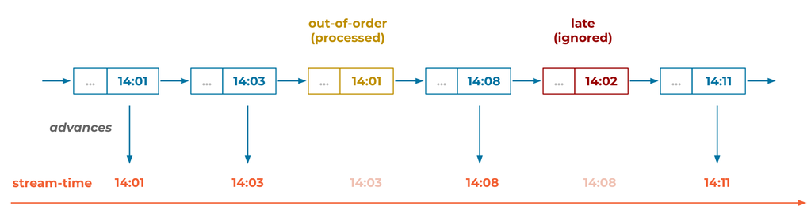

# Kafka Streams

## Contents

- [Introduction](#introduction)
- [Useful Operations](#useful-operations)
- [KTable](#ktable)
- [Hands On Examples](#hands-on-example)
    * [KStream](#kstreams)
    * [KTable](#ktables)
- [Serialisation](#serialisation)
- [Joins](#joins)
- [Stateful Operations](#stateful-operations)
    * [Aggregation Example](#aggregation-example)
- [Windowing](#windowing)
- [Time Stamps](#time-stamps)
- [Processor API](#processor-api)

## Introduction

- Filtering, grouping, aggregating, joining
- Scalable handles all distributed state problems
- Off-heap state since it's an API, persists to local disk and same state to internal topics
- Integrates within sevices and the stream processing is not separate to any "extra" functionality

A library that does not need to be on the same node as the broker, makes it elastic, scalable and fault-tolerant. It runs on it's own and connects to the Broker over the network. This means you can build applications or microservices that use the Kafka Streams API.

### Example

<hr>

Processing events in Kafka - widgets

```json
{
    "reading_ts": "2020-02-14T12:19:27Z",
    "sensor_id": "aa-101",
    "production_line": "w01",
    "widget_type": "acme94",
    "temp_celcius": 23,
    "widget_weight_g": 100
}
```

A sensor to monitor the widget as it is being manufactured to make sure e.g. temperature doesn't go too high, weight stays within reason.

#### Processing events with producer and consumer clients

If you decided to write clients that produced and consumed the log,

```java
public static void main(String[] args) {
    try(
        Consumer<String, Widget> consumer = new KafkaConsumer<>(consumerProperties());
    
        Producer<String, Widget> producer = new KafkaProducer<>(producerProperties())
    ) {
        consumer.subscribe(Collections.singletonList("widgets"));
        
        while(true){
            ConsumerRecords<String, Widget> records = consumer.poll(Duration.ofSeconds(5));
            
            for (ConsumerRecord<String, Widget> record : records) {
                Widget widget = record.value();
                
                if (widget.getColour().equals("red")){
                    ProducerRecord<String, Widget> producerRecord = new ProducerRecord<>("widgets-red", record.key(), widget);
                    producer.send(producerRecord, (metadata, exception) -> {.....} );
                }
            }
        }
    }
}
```

1) Instantiate producer and consumer
2) Direction consumer to the widgets topic
3) While there are records, for each record in a poll of 5 seonds, if widget is red, send to red widget topic

#### Kafka Streams Processing

- A lot less code 
- Producer and consumer is done under the cover of the API

```java
final StreamsBuilder builder = new StreamsBuilder();

builder.stream("widgets", Consumed.with(stringSerde, widgetSerde))
        .filter( (key, widget) -> widget.getColour.equals("red"))
        .to("widgets-red", Produced.with(stringSerde, widgetsSerde));
```

1) Streams Builder tells streams what to do and how to process events
2) Type of objects in widget topic, string as key, value is widget (Serde = serialised, deserialised)
3) Filter based on the widget colour red
4) To produce to output topic, just call .to

## Useful Operations

### Topology

Kafka streams application is just defining a processor topology. These are source nodes, user processor nodes and sink processors.

Source nodes -> use processor nodes -> sink nodes



You are describing the flow of the events.

### Defining a Stream

```java
StreamBuilder builder = new StreamBuilder();
KStream<String, String> firstStream = builder.stream(inputTopic, Consumed.with(Serdes.String(), Serdes.String()));
```

Streams events from the inputTopic and consumed specifies type of the key and value of the topic which are both streams.

***What can we do with KStreams?***

### Consume from inputTopic

```java
KStream<String, String> firstStream = builder.stream(inputTopic, Consumed.with(Serdes.String(), Serdes.String()));
```

### Produce to outputTopic

```java
.to(outputTopic, Produced.with(Serdes.String(), Serdes.String()));
```

### Mapping

We can transform the data. Kafka Streams provides a mapping operation for it.

{ old events stream } --> f(n) --> { new events stream }


```java
//maps just the value of the event and scrubs out the first 5 characters. e.g. good for credit card info
mapValues(value -> value.substring(5))

//maps entire key value pair but changes the key, not recommended unless key wants to be changed. 
map((key, value) -> ...)
```

### Filtering


```java
//e.g. good for filtering price over 1000
filter((key, value) -> Long.parseLong(value) > 1000)
```

### Peeking

Peeking allows printing to console

```java
peek((key, value) -> System.out.println("Outgoing record - key " + key + " value " + value));
```

### KTable to Stream

```java
.toStream();
```

## KTable

KTable are representations of the latest value of each record. It can only be subscribed to one single topic at once. Topic that the table really represents. 

State store, copy of events that are in the topic that the table is built from to track the latest value.

To build a table, you define a StreamBuilder but it will instead build a table through,

```java
StreamBuilder builder = new StreamBuilder();
KTable<String, String> firstKTable = 
    builder.table(inputTopic, 
                    Materialized.with(Serdes.String(), Serdes.String()));
//Materialized is just how you want to store the data in the state store


//Materialized configuration object providing name for the KTable, caching and will emit latest records after a commit (30 seconds or when cache is full at 10MB)

KTable<String, String> firstKTable =
                builder.table(inputTopic, Materialized.<String, String, KeyValueStore<Bytes, byte[]>>as("ktable-store")
                        .withKeySerde(Serdes.String())
                        .withValueSerde(Serdes.String()));
```

KTable updates based on how often you want. This is defined through commit interval which flushes the cache by default every 30s. Can be set to zero for every update or longer.

### Operations

Similarly the tables can be filtered and mapped.

```java
//maps
firstKTable.mapValues(value -> ...)
firstKTable.map((key,value) -> ...)

//filter
firstKTable.filter((key,value) -> ...)
```

### Global KTable

A KTable covers a partition in a topic. A Global KTable however covers the entire topic and all partitions in that topic. This would be used for data that is not too large e.g. country codes, post codes.

```java
StreamBuilder builder = new StreamBuilder();
GlobalKTable<String, String> firstKTable = 
    builder.globalTable(inputTopic, 
                    Materialized.with(Serdes.String(), Serdes.String()));
```
## Hands On Example

In resources folder, properties and configurations are set up. This combines the stream properties and cloud properties of where your server is.

#### ***/resources/stream.properties***

```properties
aggregate.input.topic=aggregate-input-topic
aggregate.output.topic=aggregate-output-topic
basic.input.topic=basic-input-streams
basic.output.topic=basic-output-streams
error.input.topic=streams-error-input
error.output.topic=streams-error-output
extractor.input.topic=extractor-input-topic
extractor.output.topic=extractor-output-topic
stream_one.input.topic=streams-left-side-input
stream_two.input.topic=streams-right-side-input
table.input.topic=streams-join-table-input
joins.output.topic=streams-joins-output
ktable.input.topic=ktable-input
ktable.output.topic=ktable-output
processor.input.topic=processor-input-topic
processor.output.topic=processor-output-topic
windowed.input.topic=windowed-input-topic
windowed.output.topic=windowed-output-topic
serdes.input.topic=serdes-input-topic
serdes.output.topic=serdes-output-topic
sr.input.topic=sr-input-topic
sr.output.topic=sr-output-topic

replication.factor=3

# Required connection configs for Kafka producer, consumer, and admin
bootstrap.servers=pkc-4r087.us-west2.gcp.confluent.cloud:9092
security.protocol=SASL_SSL
sasl.jaas.config=org.apache.kafka.common.security.plain.PlainLoginModule required username='[username]' password='[password]';
sasl.mechanism=PLAIN
# Required for correctness in Apache Kafka clients prior to 2.6
client.dns.lookup=use_all_dns_ips

# Best practice for higher availability in Apache Kafka clients prior to 3.0
session.timeout.ms=45000

# Best practice for Kafka producer to prevent data loss
acks=all

# Required connection configs for Confluent Cloud Schema Registry
schema.registry.url=https://psrc-4nrnd.us-central1.gcp.confluent.cloud
basic.auth.credentials.source=USER_INFO
basic.auth.user.info=[info]
```

### KStreams

#### ***BasicStreams.java***

```java
package io.confluent.developer.basic;

import org.apache.kafka.common.serialization.Serdes;
import org.apache.kafka.streams.KafkaStreams;
import org.apache.kafka.streams.StreamsBuilder;
import org.apache.kafka.streams.StreamsConfig;
import org.apache.kafka.streams.kstream.Consumed;
import org.apache.kafka.streams.kstream.KStream;
import org.apache.kafka.streams.kstream.Produced;

import java.io.FileInputStream;
import java.io.IOException;
import java.time.Duration;
import java.util.Properties;
import java.util.concurrent.CountDownLatch;

public class BasicStreams {

    public static void main(String[] args) throws IOException {
        Properties streamsProps = new Properties();
        try (FileInputStream fis = new FileInputStream("src/main/resources/streams.properties")) {
            streamsProps.load(fis);
        }
        streamsProps.put(StreamsConfig.APPLICATION_ID_CONFIG, "basic-streams");

        StreamsBuilder builder = new StreamsBuilder();
        final String inputTopic = streamsProps.getProperty("basic.input.topic");
        final String outputTopic = streamsProps.getProperty("basic.output.topic");

        final String orderNumberStart = "orderNumber-";

        // Using the StreamsBuilder from above, create a KStream with an input-topic
        // and a Consumed instance with the correct
        // Serdes for the key and value HINT: builder.stream and Serdes.String()
        KStream<String, String> firstStream = builder.stream(inputTopic, Consumed.with(Serdes.String(), Serdes.String()));

        //prints record as they come into the topology
        firstStream.peek((key, value) -> System.out.println("Incoming record - key " + key + " value " + value))
                // filter records by making sure they contain the orderNumberStart variable from above HINT: use filter
                .filter((key, value) -> value.contains(orderNumberStart))
                // map the value to a new string by removing the orderNumberStart portion HINT: use mapValues
                .mapValues(value -> value.substring(value.indexOf("-")+1))
                // only forward records where the value is 1000 or greater HINT: use filter and Long.parseLong
                .filter((key, value) -> Long.parseLong(value) > 1000)
                // prints transformed records
                .peek((key, value) -> System.out.println("Outgoing record - key " + key + " value " + value))
                // Write the results to an output topic defined above as outputTopic HINT: use "to" and Produced and Serdes.String()
                .to(outputTopic, Produced.with(Serdes.String(), Serdes.String()));

        // creates Kafka Streams instance
        try (KafkaStreams kafkaStreams = new KafkaStreams(builder.build(), streamsProps)) {
            final CountDownLatch shutdownLatch = new CountDownLatch(1);

            Runtime.getRuntime().addShutdownHook(new Thread(() -> {
                kafkaStreams.close(Duration.ofSeconds(2));
                shutdownLatch.countDown();
            }));
            TopicLoader.runProducer(); //produces sample records but not part of standard application
            try {
                kafkaStreams.start(); //starts the application
                shutdownLatch.await();
            } catch (Throwable e) {
                System.exit(1);
            }
        }
        System.exit(0);
    }
}
```

Aftwards you can start the basic operations example with the command from the kafka-streams folder (https://github.com/confluentinc/learn-kafka-courses.git)

```bash
./gradlew runStreams -Pargs=basic
```

### KTables

***KTableExample.java***

```java
package io.confluent.developer.ktable;

import org.apache.kafka.common.serialization.Serdes;
import org.apache.kafka.common.utils.Bytes;
import org.apache.kafka.streams.KafkaStreams;
import org.apache.kafka.streams.StreamsBuilder;
import org.apache.kafka.streams.StreamsConfig;
import org.apache.kafka.streams.kstream.KTable;
import org.apache.kafka.streams.kstream.Materialized;
import org.apache.kafka.streams.kstream.Produced;
import org.apache.kafka.streams.state.KeyValueStore;

import java.io.FileInputStream;
import java.io.IOException;
import java.time.Duration;
import java.util.Properties;
import java.util.concurrent.CountDownLatch;

public class KTableExample {

    public static void main(String[] args) throws IOException {
        final Properties streamsProps = new Properties();
        try (FileInputStream fis = new FileInputStream("src/main/resources/streams.properties")) {
            streamsProps.load(fis);
        }
        streamsProps.put(StreamsConfig.APPLICATION_ID_CONFIG, "ktable-application");

        StreamsBuilder builder = new StreamsBuilder();
        final String inputTopic = streamsProps.getProperty("ktable.input.topic");
        final String outputTopic = streamsProps.getProperty("ktable.output.topic");

        final String orderNumberStart = "orderNumber-";

        // Crate a table with the StreamBuilder from above and use the table method
        // along with the inputTopic create a Materialized instance and name the store
        // and provide a Serdes for the key and the value  HINT: Materialized.<String, String, KeyValueStore<Bytes, byte[]>>as
        // then use two methods to specify the key and value serde
        KTable<String, String> firstKTable =
                builder.table(inputTopic, Materialized.<String, String, KeyValueStore<Bytes, byte[]>>as("ktable-store")
                        .withKeySerde(Serdes.String())
                        .withValueSerde(Serdes.String()));

        firstKTable.filter((key, value) -> value.contains(orderNumberStart))
                .mapValues(value -> value.substring(value.indexOf("-") + 1))
                .filter((key, value) -> Long.parseLong(value) > 1000)
                // Add a method here to covert the table to a stream
                .toStream()
                .peek((key, value) -> System.out.println("Outgoing record - key "+ key + " value " + value))
                .to(outputTopic, Produced.with(Serdes.String(), Serdes.String()));

        try (KafkaStreams kafkaStreams = new KafkaStreams(builder.build(), streamsProps)) {
            final CountDownLatch shutdownLatch = new CountDownLatch(1);

            Runtime.getRuntime().addShutdownHook(new Thread(() -> {
                kafkaStreams.close(Duration.ofSeconds(2));
                shutdownLatch.countDown();
            }));
            TopicLoader.runProducer();
            try {
                kafkaStreams.start();
                shutdownLatch.await();
            } catch (Throwable e) {
                System.exit(1);
            }
        }
        System.exit(0);
    }
}
```

## Serialisation

Kafka brokers only know records and events as bytes. The consumer receives bytes, producer sends bytes. How to convert objects into bytes that can be sent across network or put into state store.

#### Deserialize

Bytes to objects


#### Serialize

Objects to bytes


This is specified through,

```java
Consumed.with(Serdes.String(), customObjectSerde);
```

which is a built in Serdes which just says that the key is a String type in the topic. 

Whenever you want to create a type that is more complex such as an object, you will need customObjectSerde. This is the same with producers.

#### Custom Serde

```java
Serde<T> serde = Serdes.serdeFrom(new CustomSerializer<T>, new CustomDeserializer<T>);
```

How to get custom serializer or deserializer? Implement interface of the Kafka client library telling it how to convert from object to bytes or vice versa.

Kafka provides out of the box serdes, especially for data formats like Avro or JSON.

#### Getting SerDes for Avro records

```java
static <T extends SpecificRecord> SpecificAvroSerde<T> getSpecificAvroSerde(final Map<String, Object> serdeConfig) {
        final SpecificAvroSerde<T> specificAvroSerde = new SpecificAvroSerde<>();
        specificAvroSerde.configure(serdeConfig, false);
        return specificAvroSerde;
    }
```

## Joins

### Stream-stream

 - Combines two event streams into new event stream
 - Joins events based on a common key
 - In a defined window of time
 - Stored in local date store
 - Can change value type or keep the same

 ### Stream-table

 - Not windowed
 - Latest value of table is joined with the stream coming in
 - Results in stream

 ### Table-table

 - Only KTable to KTable and GlobalKTable to Stream
 - Results in table

 ### Types of Join

 #### Stream-stream

 - Inner - only output record if both sides have record available
 - Outer - both sides will always output record including nulls from either side
 - Left-Outer - left side always produces an output record, so no null + right_value, only if left side has a value

 #### Stream-table

 - Inner - only if both sides are available
 - Left-Outer - always produces an output from the left side

 The Stream side drives the joibs and applies to both KTable and GlobalKTable.

 GlobalKTable is bootstrapped (static)
 
 KTable is timestamped

 ### Code Example

 Need to define a value joiner and what the two types will be joined into.

 ```java
 KStream<String, String> leftStream = builder.stream("topic-A");
 KStream<String, String> rightStream = builder.stream("topic-B");

 ValueJoiner<String, String, String> valueJoiner = (leftValue, rightValue) -> {
    return leftValue + rightValue; //appends the strings together e.g. name
 };

 leftStream.join(rightStream,
                valueJoiner,
                JoinWindows.of(Duration.ofSeconds(10))); //amount of time two can differ
 ```

### Join Hands On

***StreamJoins.java***
```java
package io.confluent.developer.joins;

import io.confluent.developer.StreamsUtils;
import io.confluent.developer.avro.ApplianceOrder;
import io.confluent.developer.avro.CombinedOrder;
import io.confluent.developer.avro.ElectronicOrder;
import io.confluent.developer.avro.User;
import io.confluent.kafka.streams.serdes.avro.SpecificAvroSerde;
import org.apache.avro.specific.SpecificRecord;
import org.apache.kafka.common.serialization.Serdes;
import org.apache.kafka.streams.KafkaStreams;
import org.apache.kafka.streams.StreamsBuilder;
import org.apache.kafka.streams.StreamsConfig;
import org.apache.kafka.streams.kstream.Consumed;
import org.apache.kafka.streams.kstream.JoinWindows;
import org.apache.kafka.streams.kstream.Joined;
import org.apache.kafka.streams.kstream.KStream;
import org.apache.kafka.streams.kstream.KTable;
import org.apache.kafka.streams.kstream.Materialized;
import org.apache.kafka.streams.kstream.Produced;
import org.apache.kafka.streams.kstream.StreamJoined;
import org.apache.kafka.streams.kstream.ValueJoiner;

import java.io.IOException;
import java.time.Duration;
import java.time.Instant;
import java.util.Map;
import java.util.Properties;
import java.util.concurrent.CountDownLatch;

public class StreamsJoin {

    //static helper to get SerDes for Avrod records (should be abstracted)
    static <T extends SpecificRecord> SpecificAvroSerde<T> getSpecificAvroSerde(final Map<String, Object> serdeConfig) {
        final SpecificAvroSerde<T> specificAvroSerde = new SpecificAvroSerde<>();
        specificAvroSerde.configure(serdeConfig, false);
        return specificAvroSerde;
    }

    public static void main(String[] args) throws IOException {

        Properties streamsProps = StreamsUtils.loadProperties();
        streamsProps.put(StreamsConfig.APPLICATION_ID_CONFIG, "joining-streams");

        StreamsBuilder builder = new StreamsBuilder();
        String streamOneInput = streamsProps.getProperty("stream_one.input.topic");
        String streamTwoInput = streamsProps.getProperty("stream_two.input.topic");
        String tableInput = streamsProps.getProperty("table.input.topic");
        String outputTopic = streamsProps.getProperty("joins.output.topic");

        Map<String, Object> configMap = StreamsUtils.propertiesToMap(streamsProps); //hashmap of the configurations (dictionary)

        //create required serdes for all streams and table
        SpecificAvroSerde<ApplianceOrder> applianceSerde = getSpecificAvroSerde(configMap);
        SpecificAvroSerde<ElectronicOrder> electronicSerde = getSpecificAvroSerde(configMap);
        SpecificAvroSerde<CombinedOrder> combinedSerde = getSpecificAvroSerde(configMap);
        SpecificAvroSerde<User> userSerde = getSpecificAvroSerde(configMap);

        //left-outer join combines the appliance and electronic orders into a new Kafka Stream instance (topology is built)
        ValueJoiner<ApplianceOrder, ElectronicOrder, CombinedOrder> orderJoiner =
                (applianceOrder, electronicOrder) -> CombinedOrder.newBuilder()
                        .setApplianceOrderId(applianceOrder.getOrderId())
                        .setApplianceId(applianceOrder.getApplianceId())
                        .setElectronicOrderId(electronicOrder.getOrderId())
                        .setTime(Instant.now().toEpochMilli())
                        .build();

        //stream-table join where the username is added to the combined order if it exists
        ValueJoiner<CombinedOrder, User, CombinedOrder> enrichmentJoiner = (combined, user) -> {
            if (user != null) {
                combined.setUserName(user.getName());
            }
            return combined;
        };

        KStream<String, ApplianceOrder> applianceStream =
                builder.stream(streamOneInput, Consumed.with(Serdes.String(), applianceSerde))
                        .peek((key, value) -> System.out.println("Appliance stream incoming record key " + key + " value " + value));

        KStream<String, ElectronicOrder> electronicStream =
                builder.stream(streamTwoInput, Consumed.with(Serdes.String(), electronicSerde))
                        .peek((key, value) -> System.out.println("Electronic stream incoming record " + key + " value " + value));

        KTable<String, User> userTable =
                builder.table(tableInput, Materialized.with(Serdes.String(), userSerde));

        //combines electronic and appliance using orderJoiner to create new KStream
        KStream<String, CombinedOrder> combinedStream =
                applianceStream.join(electronicStream,
                        orderJoiner,
                        JoinWindows.of(Duration.ofMinutes(30)),
                        StreamJoined.with(Serdes.String(), applianceSerde, electronicSerde)) //
                        .peek((key, value) -> System.out.println("Stream-stream join record key " + key + " value " + value));

        //combines combinedStream with the userTable and outputs to topic
        combinedStream.leftJoin(userTable,
                enrichmentJoiner,
                Joined.with(Serdes.String(), combinedSerde, userSerde))
                .peek((key, value) -> System.out.println("Stream-table join record key " + key + " value " + value))
                .to(outputTopic, Produced.with(Serdes.String(), combinedSerde));


        try (KafkaStreams kafkaStreams = new KafkaStreams(builder.build(), streamsProps)) {
            final CountDownLatch shutdownLatch = new CountDownLatch(1);

            Runtime.getRuntime().addShutdownHook(new Thread(() -> {
                kafkaStreams.close(Duration.ofSeconds(2));
                shutdownLatch.countDown();
            }));
            TopicLoader.runProducer();
            try {
                kafkaStreams.start();
                shutdownLatch.await();
            } catch (Throwable e) {
                System.exit(1);
            }
        }
        System.exit(0);
    }
}
```

## Stateful Operations

- Stateful operations are used when you want to know previous results. Stateless operations could be for example a filter, where records that don't match a condition are dropped
- Other times you wish to remember previous results such as total sum of tickets sold or times a customer has logged in

Setup and operations:

- under the hood, first group all events by key
- count - counts how many keys are seen
- reduce - combine events in your stream into other event
- aggregate - superset of reduce, aggregate data seen for this topic into whatever result you want

#### Reduce

```java
StreamsBuilder builder = new StreamsBuilder();
KStream<String, Long> myStream = builder.stream("topic-A");

Reducer<Long> reducer = (longValueOne, longValueTwo) -> longValueOne + longValueTwo;

myStream.groupByKey().reduce(reducer,
                            Materialized.with(Serdes.String(), Serdes.Long())) //materialized into KTable
                            .toStream() //converted back to KStream
                            .to("outputTopic");
```
#### Aggregation

Superset of reduce, does not have restriction of combining events of the same type

```java
StreamsBuilder builder = new StreamsBuilder();
KStream<String, String> myStream = builder.stream("topic-A");

Aggregator<String, String, Long> characterCountAgg = 
                    (key, value, charCount) -> value.length() + charCount;
myStream.groupByKey().aggregate(() -> 0L,
                                        characterCountAgg,
                                        Materialized.with(Serdes.String(), Serdes.Long()))
                    .toStream()
                    .to("outputTopic");
```

aggregate first argument is the intialiser. In this above example, this function is what the initial count will be, zero type Long.

Considerations:

- Stateful operations don't emit results immediately
- Internal caching buffer results
    * Factors:
        - Cache size 
        - Commit interval
        - Set both to zero to see all updates

#### Aggregation Example

```java
package io.confluent.developer.aggregate;

import io.confluent.developer.StreamsUtils;
import io.confluent.developer.avro.ElectronicOrder;
import io.confluent.kafka.streams.serdes.avro.SpecificAvroSerde;
import org.apache.kafka.common.serialization.Serde;
import org.apache.kafka.common.serialization.Serdes;
import org.apache.kafka.streams.KafkaStreams;
import org.apache.kafka.streams.StreamsBuilder;
import org.apache.kafka.streams.StreamsConfig;
import org.apache.kafka.streams.kstream.*;

import java.io.IOException;
import java.time.Duration;
import java.util.Map;
import java.util.Properties;
import java.util.concurrent.CountDownLatch;

public class StreamsAggregate {

    public static void main(String[] args) throws IOException {

        final Properties streamsProps = StreamsUtils.loadProperties();
        streamsProps.put(StreamsConfig.APPLICATION_ID_CONFIG, "aggregate-streams");

        StreamsBuilder builder = new StreamsBuilder();
        final String inputTopic = streamsProps.getProperty("aggregate.input.topic");
        final String outputTopic = streamsProps.getProperty("aggregate.output.topic");
        final Map<String, Object> configMap = StreamsUtils.propertiesToMap(streamsProps);

        final SpecificAvroSerde<ElectronicOrder> electronicSerde =
                StreamsUtils.getSpecificAvroSerde(configMap);

        final KStream<String, ElectronicOrder> electronicStream =
                builder.stream(inputTopic, Consumed.with(Serdes.String(), electronicSerde))
                        .peek((key, value) -> System.out.println("Incoming record - key " + key + " value " + value));

        //aggregator that adds the running total
        //takes in the key, order and produces total
        Aggregator<String, ElectronicOrder, Double> totalCount =
                (key, order, total) -> order.getPrice() + total;
       
        //groups and aggregates the stream based on aggregator, giving initial double value 0.00
        electronicStream.groupByKey().aggregate(() -> 0.00,
                                        totalCount,
                                        Materialized.with(Serdes.String(), Serdes.Double()))
                                        .toStream()
                                        .peek((key, value) -> System.out.println("key " + key + " value " + value))
                                        .to(outputTopic);

        try (KafkaStreams kafkaStreams = new KafkaStreams(builder.build(), streamsProps)) {
            final CountDownLatch shutdownLatch = new CountDownLatch(1);

            Runtime.getRuntime().addShutdownHook(new Thread(() -> {
                kafkaStreams.close(Duration.ofSeconds(2));
                shutdownLatch.countDown();
            }));
            TopicLoader.runProducer();
            try {
                kafkaStreams.start();
                shutdownLatch.await();
            } catch (Throwable e) {
                System.exit(1);
            }
        }
        System.exit(0);
    }
}
```

## Windowing

Stateful operations will continue unless specified. In order to limit the timing, windowing is used to restrict how long the operation goes on for.

```java
KStream<String, String> myStream = builder.stream("topic-A");
myStream.groupByKey().count().toStream().to("output");
```

This count will count the key and keep going up and up of the entire history.

Windows gives snapshots of an aggregate within a timeframe.

#### Hopping Window

This window has a duration and advance size. The duration indicates the range of the window and the advance size is how that range is advanced. E.g. duration = 5 minutes, advance = 1 minute. This would mean the first window is from 0 to 5 minutes and the second window would be 1 to 6.

```java
KStream<String, String> myStream = builder.stream("topic-A");
Duration windowSize = Duration.ofMinutes(5);
Duration advanceSize = Duration.ofMinutes(1);

TimeWindows hoppingWindow = 
            TimeWindows.of(windowSize).advanceBy(advanceSize);

myStream.groupByKey()
        .windowedBy(hoppingWindow)
        .count();
```

#### Tumbling Window

Special type of hopping where windowSize = advanceSize. Therefore there are no duplicates. Unique results. No need to declare advance size, only need window size.

#### Session Window

 Not time-driven, window start and end are not fixed. Inactivity gap determines the session window. In the example below, if there are no new events within 5 minutes, the count restarts.

 ```java
KStream<String, String> myStream = builder.stream("topic-A");
Duration inactivityGap = Duration.ofMinutes(5);

myStream.groupByKey()
        .windowedBy(SessionWindows.with(inactivityGap))
        .count();
 ```

 E.g user browser sessions, log into site, leave and come back, count session as a whole

 #### Sliding Window

 Similar to hopping with fixed size. But driven by actual events rather than time. Only gives one output result compared to hopping which can have duplicates. What if an event falls outside the fixed time size and a new event comes in. The grace period comes in on any of the windows to allow events after to be aggregated.

```java
KStream<String, String> myStream = builder.stream("topic-A");
Duration timeDifference = Duration.ofSeconds(2);
Duration gracePeriod = Duration.ofMillis(500);

myStream.groupByKey()
        .windowedBy(SlidingWindows.withTimeDifferenceAndGrace(timeDifference, gracePeriod))
        .count();
```

#### Useful Methods

**Suppress**

```java
.suppress(untilWindowCloses(unbounded()))
```

Results aren't emitted until the window closes

**Mapping**

When the grouped by key stream is windowed, Kafka Streams wraps the key in a Windowed Class. therefore it is a good idea to extract the underlying key from the Windowed instance

```java
.map((wk, value) -> KeyValue.pair(wk.key(), value))
```

### Windowing Example

```java
package io.confluent.developer.windows;

import io.confluent.developer.StreamsUtils;
import io.confluent.developer.avro.ElectronicOrder;
import io.confluent.kafka.streams.serdes.avro.SpecificAvroSerde;
import org.apache.kafka.common.serialization.Serdes;
import org.apache.kafka.streams.KafkaStreams;
import org.apache.kafka.streams.KeyValue;
import org.apache.kafka.streams.StreamsBuilder;
import org.apache.kafka.streams.StreamsConfig;
import org.apache.kafka.streams.kstream.*;

import java.io.IOException;
import java.time.Duration;
import java.util.Map;
import java.util.Properties;
import java.util.concurrent.CountDownLatch;

import static org.apache.kafka.streams.kstream.Suppressed.*;
import static org.apache.kafka.streams.kstream.Suppressed.BufferConfig.*;

public class StreamsWindows {

    public static void main(String[] args) throws IOException {

        final Properties streamsProps = StreamsUtils.loadProperties();
        streamsProps.put(StreamsConfig.APPLICATION_ID_CONFIG, "windowed-streams");

        StreamsBuilder builder = new StreamsBuilder();
        final String inputTopic = streamsProps.getProperty("windowed.input.topic");
        final String outputTopic = streamsProps.getProperty("windowed.output.topic");
        final Map<String, Object> configMap = StreamsUtils.propertiesToMap(streamsProps);

        final SpecificAvroSerde<ElectronicOrder> electronicSerde =
                StreamsUtils.getSpecificAvroSerde(configMap);

        final KStream<String, ElectronicOrder> electronicStream =
                builder.stream(inputTopic, Consumed.with(Serdes.String(), electronicSerde))
                        .peek((key, value) -> System.out.println("Incoming record - key " + key + " value " + value));

        //defined window size and grace period
        Duration windowSize = Duration.ofMinutes(60);
        Duration gracePeriod = Duration.ofMinutes(5);

        electronicStream.groupByKey()
                .windowedBy(TimeWindows.of(windowSize).grace(gracePeriod)) //windowing
                .aggregate(() -> 0.0,
                        (key, order, total) -> total + order.getPrice(),
                        Materialized.with(Serdes.String(), Serdes.Double()))
                
                //suppresses emit until window closes
                .suppress(untilWindowCloses(unbounded()))
                .toStream()
                //Key is in Windowed class, therefore use map to extract
                .map((wk, value) -> KeyValue.pair(wk.key(), value))
                .peek((key, value) -> System.out.println("Outgoing record - key " + key + " value " + value))
                .to(outputTopic, Produced.with(Serdes.String(), Serdes.Double()));

        try (KafkaStreams kafkaStreams = new KafkaStreams(builder.build(), streamsProps)) {
            final CountDownLatch shutdownLatch = new CountDownLatch(1);

            Runtime.getRuntime().addShutdownHook(new Thread(() -> {
                kafkaStreams.close(Duration.ofSeconds(2));
                shutdownLatch.countDown();
            }));
            TopicLoader.runProducer();
            try {
                kafkaStreams.start();
                shutdownLatch.await();
            } catch (Throwable e) {
                System.exit(1);
            }
        }
        System.exit(0);
    }
}
```

## Time Stamps

- Event-time - a producer automatically sets this timestamp if user does not. This is the current wall-clock the time of the Producer environment when the event is created

- Ingestion-time - can configure the Kafka broker to set this timestap when an event is appended to the topic. This is the current wall-clock time of the Broker environment

- Kafka streams uses the ***TimestampExtractor*** interface to get timestamp of the event. This by default is the event timestamp. Default extractor is ***FailOnInvalidTimestamp***. A custom TimestampExtractor can be created to use a timestamp that is embedded in the event payload (e.g. the event key or value being the timestamp)

- If a *out-of-order* event is put in, the stream time stays where it is

- Out-of-order events may occur for example when a producer fails and repeats the event. If this event is still within the window, it will be processed. This does not occur if everything is broker time.



- Late events outside the window and grace period is ignored
- The balance of the window is speed vs all data available

### Example Timestamp Extractor

```java
package io.confluent.developer.time;

import io.confluent.developer.StreamsUtils;
import io.confluent.developer.avro.ElectronicOrder;
import io.confluent.kafka.streams.serdes.avro.SpecificAvroSerde;
import org.apache.kafka.clients.consumer.ConsumerRecord;
import org.apache.kafka.common.serialization.Serdes;
import org.apache.kafka.streams.KafkaStreams;
import org.apache.kafka.streams.KeyValue;
import org.apache.kafka.streams.StreamsBuilder;
import org.apache.kafka.streams.StreamsConfig;
import org.apache.kafka.streams.kstream.Consumed;
import org.apache.kafka.streams.kstream.KStream;
import org.apache.kafka.streams.kstream.Materialized;
import org.apache.kafka.streams.kstream.Produced;
import org.apache.kafka.streams.kstream.TimeWindows;
import org.apache.kafka.streams.processor.TimestampExtractor;

import java.io.IOException;
import java.time.Duration;
import java.util.Map;
import java.util.Properties;
import java.util.concurrent.CountDownLatch;

public class StreamsTimestampExtractor {

    //implements custom timestamp extractor that overrides the extract method
    static class OrderTimestampExtractor implements TimestampExtractor {
        @Override
        public long extract(ConsumerRecord<Object, Object> record, long partitionTime) {
            ElectronicOrder order = (ElectronicOrder) record.value();
            System.out.println("Extracting time of " + order.getTime() + " from " + order);
            return order.getTime();
        }
    }

    public static void main(String[] args) throws IOException {

        final Properties streamsProps = StreamsUtils.loadProperties();
        streamsProps.put(StreamsConfig.APPLICATION_ID_CONFIG, "extractor-windowed-streams");

        StreamsBuilder builder = new StreamsBuilder();
        final String inputTopic = streamsProps.getProperty("extractor.input.topic");
        final String outputTopic = streamsProps.getProperty("extractor.output.topic");
        final Map<String, Object> configMap = StreamsUtils.propertiesToMap(streamsProps);

        final SpecificAvroSerde<ElectronicOrder> electronicSerde =
                StreamsUtils.getSpecificAvroSerde(configMap);

        final KStream<String, ElectronicOrder> electronicStream =
                builder.stream(inputTopic,
                                Consumed.with(Serdes.String(), electronicSerde)
                        //consumed with timestamp extractor that is initialised with above
                        .withTimestampExtractor(new OrderTimestampExtractor()))
                        .peek((key, value) -> System.out.println("Incoming record - key " + key + " value " + value));

        //sets tumbling window that makes sure no data is missed
        electronicStream.groupByKey().windowedBy(TimeWindows.of(Duration.ofHours(1)))
                .aggregate(() -> 0.0,
                        (key, order, total) -> total + order.getPrice(),
                        Materialized.with(Serdes.String(), Serdes.Double()))
                .toStream()
                .map((wk, value) -> KeyValue.pair(wk.key(), value))
                .peek((key, value) -> System.out.println("Outgoing record - key " + key + " value " + value))
                .to(outputTopic, Produced.with(Serdes.String(), Serdes.Double()));

        try (KafkaStreams kafkaStreams = new KafkaStreams(builder.build(), streamsProps)) {
            final CountDownLatch shutdownLatch = new CountDownLatch(1);

            Runtime.getRuntime().addShutdownHook(new Thread(() -> {
                kafkaStreams.close(Duration.ofSeconds(2));
                shutdownLatch.countDown();
            }));
            TopicLoader.runProducer();
            try {
                kafkaStreams.start();
                shutdownLatch.await();
            } catch (Throwable e) {
                System.exit(1);
            }
        }
        System.exit(0);
    }
}
```

## Processor API

So far we have been using DSL to build applications and operators. DSL provides high-level operators that build the topology for you. 

The Processor API allows you to have full control of the node by node. Gives more flexibility.

Gives direct access to state store which allows puts and gets. Can call commit directly. This is a request to commit, signalling Kafka Streams, allowing you to schedule arbitrary operations with Punctuation. This can be through stream time processing or wall clock time.

Steps to build stream applications with Processor API:

- Add source nodes
- Add N number of processors which are child nodes of source node
- Optionally create one or more StoreBuilder instances and attack to processing nodes
- Add sink nodes and make them child node of processor nodes

A StoreBuilder is just an instance which tells this node to attach a state store that can be used when processing events through this node.

Give a node the parent node and it will connect automatically. A parent node can have many children nodes. Vice versa.

### Example Topology Creation

```java
Topology topology = new Topology();

topology.addSource("source-node", "topicA", "topicB"); //source node reads these topics

topology.addProcessor("custom-processor", new CustomProcessorSupplier(storeName), "source-node"); //second argument initialises the processor, parent node is defined last

topology.addSink("sink-node", "output-topic", "custom-processor")
```

It is possible to mix in Processor API with Streams DSL through:

- transform
- transformValues
- process

