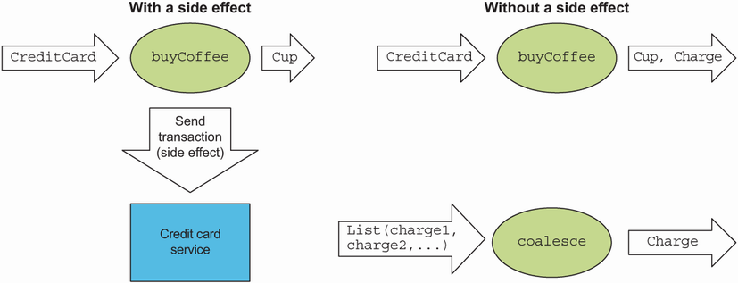
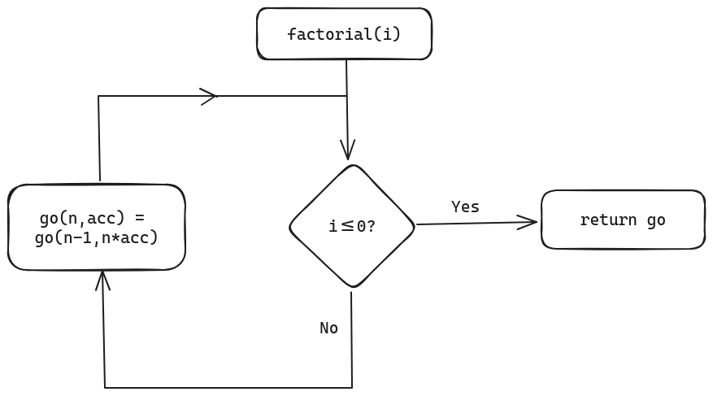
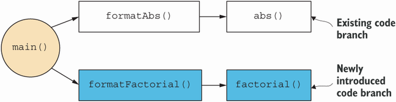

# Kotlin - Functional Programming

## Introduction

Imperative style:

- Side effects 
    * Modifying a variable beyond the scope of the block
    * Modifying a data structure in place
    * Setting a field in an object
    * Throwing an exception or halting with an error
    * Printing to console or reading user input
    * Reading from or writing to a file

Functional Programming:

- Pure functions
- No side effects
- Immutable data structures 
- Easier to test, maintain and scale
- Parallelisable

### Cafe Example

An example program with side effects is a program that handles purchases at a coffee shop,

```kotlin
class Cafe {
    fun buyCoffee(cc: CreditCard): Coffee {
        
        val cup = Coffee()
        
        cc.charge(cup.price)  // side effect
        
        return cup
    }
}
```

The idea is that the function returns a `Coffee` ofbject but the action of charging the price is happening on the side.

### Improvements

#### 1. Adding a Payments Object

The above code is hard to test since if the `charge` method is fixed to real situation of contacting card provider.

```kotlin
class Cafe {
    fun buyCoffee(cc: CreditCard, p: Payments): Coffee {
        val cup = Coffee()

        p.charge(cc, cup.price)

        return cup
    }
}
```

Although side effects still occur, we have regained some testability with the `Payments` object, where a mock environment can be created to test.

We still have an issue where it is difficult to reuse the method for multiple coffees. 

#### 2. More Functional Approach to Buying Coffee

The functional solution is to eliminate side effects and have `buyCoffee` return the charge and `Coffee` object.


Figure 1.1 A call to buyCoffee, with and without a side effect

A functional solution may instead be,

```kotlin
class Cafe {
    fun buyCoffee(cc: CreditCard): Pair<Coffee, Charge> {
        
        val cup = Coffee()

        return Pair(cup, Charge(cc, cup.price))
    }
}
```

Charge is a data class type where it just has properties and some function. This makes it easier to resuse.

```kotlin
data class Charge(val cc: CreditCard, val amount: Float) {
    
    fun combine (other: Charge): Charge = 
        if (cc == other.cc)
            Charge(cc, amount + other.amount)
        else throw Exception(
            "Cannot combine charges to different cards"
        )
}
```

This data type is responsible for holding the values for a `CreditCard` and amount `Float`. A handy method allows this `Charge` to be combined with other `Charge` instances. The throwing of an exception is not ideal but will be covered later.

##### 2.5 Implmenting buyCoffees

Now we can implement a purchase of multiple coffees through a new function.

```kotlin
class Cafe {
    
    fun buyCoffee(cc: CreditCard): Pair<Coffee, Charge> = TODO()

    fun buyCoffees(
        cc: CreditCard,
        n: Int
    ): Pair<List<Coffee>, Charge> {

        val purchases: List<Pair<Coffee, Charge>> = List(n) { buyCoffee(cc) } //self initialised list

        val (coffees, charges) = purchases.unzip()

        return Pair(
            coffees,
            charges.reduce { c1, c2 -> c1.combine(c2) }
        )
    }
}
```

This new function of `buyCoffees` takes in two parameters of `CreditCard` and `n` which represents the number of orders.

After the coffee has been purchased they are put into a `List` where it is initialised through the `buyCoffee(cc)` function.

Then the list is unzipped into two separate lists of `coffees` and `charges`. Finally the two lists are reconstructed into the required output of a `Pair<List<Coffee>, Charge>` through mapping the list of coffees to the combined charges for all the coffees in the list. `reduce` will be covered later.

Overall this solution is an improvement as we are able to reuse `buyCoffee` to define the `buyCoffees` function. Both functions can be tested without implementation of `Payments` from before and `Cafe` is now ignorant of how `Charge` values will be processed.

### Referential Transparency (RT)

- In any program, the expressionn can be replaced by its result without changing the meaning of the program. 
- A function is pure if calling it with RT arguments is also RT.

- An expression `e` is RT if, for all programs `p`, all occurences of `e` can be replaced by the result of evaluating `e` without affecting the meaning of `p`.
- A function `f` is pure if the expression `f(x)` is RT for all RT `x`.

#### Using Coffee Example

Let's see how RT applies to original `buyCoffee` example,

```kotlin
fun buyCoffee(cc: CreditCard): Coffee {
    val cup = Coffee()
    cc.charge(cup.price);
    return cup
}
```

The return type of `cc.charge(cup.price)` is discarded by buyCoffee, even though it's Unit (void in Java). The result of evaluating `buyCoffee(KevinsCard)` will be `cup` which is a new instance of `Coffee()`.

For this function to be pure in the definition of RT, `p(buyCoffe(KevinsCard))` must behave the same as `p(Coffee())` for any `p`.

This is not the case since the program `Coffee()` does not do anything whereas `buyCoffee()` will authorise a charge.

RT enforces that everything a funtion does, should be represented by the value it returns.

Mathematically is is like solving an algebraic equation. Expand each part of the expression, replacing all variables with their referents and then reducing to its simplest form. 

#### Simple Example

```kotlin
val x = "Hello, World"

val r1 = x.reversed()

val r2 = x.reversed()
```

If all the expressions of `x` in `r1` and `r2` are replaced by `"Hello, World"`, everything would work exactly the same, therefore `x` is RT.

```kotlin
val x = StringBuilder("Hello")

val y = x.append(", World")

val r1 = y.toString()

val r2 = y.toString()
```

The code above is not pure as replacing  all occurences of `y` with the expressed referenced by `y`,  `(x.apppend(", World"))` would not give the same results. 

A pure function is modular and composable because it separates computation logic from "what to do with the result" and "how to get the input". It is a black box.

## Getting Started

### Higher-order functions: Passing functions to functions

The first new idea is that **functions are values**.

Functions can be assigned to variables, stored in data structures and passed as arguments to other functions or itself.

#### Example

 We want to adapt our program to print out both absolute value of a number and the factorial of another number.

 ```console
The absolute value of -42 is 42
The factorial of 7 is 5040
 ```

 We can write a loop for the `factorial` but instead of the imperative way, we use the pure functional way,

 ```kotlin
fun factorial(i: Int): Int {
    
    fun go(n: Int, acc: Int): Int =
        if (n <=0) acc
        else go( n - 1, n * acc)

    return go(i, 1)
}

fun main() {
    println(factorial(5))
}
 ```

 1. The function `factorial` takes in an integer `i`.
 2. It calls the return of `go(i,1)`, which calls the function `go`.
 3. If `i > 0` the `go` function is called recursively, taking in the current value of `n` and `acc` until `n<=0`
 4. Loops ends by assigning the function `go` the value of acc and that is what is returned

 

#### Helper Function

In the code above, we define a recursive helper function `go` inside the body of the `factorial` function. This function handles the recursive calls that require an accumulator or some signature change that the *enclosing* function does not have.

The convention of these helper functions is by calling them `go` or `loop`.

#### Tail Calls

Kotlin does not *manually* detect this sort of self-recursion but requires the function to declare the `tailrec` modifier. This will instruct the compiler to emit the same kind of bytecode as would be for a `while` loop. This is for optimisation.

When a recursive function is implemented, each call to the function adds a new frame to the call stack, which holds information about the execution state of that call. If the recursion is deep enough, this can lead to the call stack becoming too large, which results in a `StackOverflowError`.

The `tailrec` modifier instructs the compilter to eliminate the tail calls, meaning no new frame is added to the call stack, instead current frame is used to do the recursive call.

```kotlin
fun factorial... {
    tailrec fun go(n: Int, acc: Int): Int = // rest of code
}
```

It will also tell us if the function has no tail call if the `tailrec` modifier is applied.

#### Fibonacci Exercise

Write a recursive function to get the *n*th Fibonacci number.

0 1 1 2 3 5 8 12 21 ...

```kotlin
fun fib(i: Int): Int {
    
    tailrec fun loop(n: Int, prev: Int, current: Int): Int =
    	if(n <= 0) prev
		else loop(n-1, current, prev+current)
    
    return loop(i, 0, 1)
}
```

Logic:

- `i` gives the *n*th term and calls the `fib` function
- the function calls the `loop` function which takes in the first and current value
- 

Key Notes:

- Things to keep track of:
    * *n*th term gives us the "count"
    * previous number and current number is needed 


## First Higher Order Function Example


Figure 2.1 Introducing new behavior to our program by adding functions related to factorials

In order to utilise the functions of factorial or fibonacci, we create higher order functions that use these functions as an argument. This gives us diversity to the `main()` function that can utilise these HOF.

An example of HOF in our case is a function that formats the results we get from calling the `abs`, `factorial` or `fib` functions.

```kotlin
import Operations.formatResult
//import Operations.factorial
import Operations.abs
import Operations.fib

object Operations {

    public fun abs(n: Int): Int =
        if (n<0) -n
        else n
    

    public fun factorial(i: Int): Int {
        tailrec fun go(n: Int, acc: Int): Int =
            if (n<=0) acc
            else go(n-1, n*acc)
        return go(i,1)
    }

    public fun fib(i: Int): Int {
        tailrec fun loop(n: Int, a: Int, b: Int): Int = 
            if (n<=0) a
            else loop(n-1, b, a+b)
        return loop(i,0,1)
    }

    fun formatResult(name: String, n: Int, f: (Int) -> Int): String {
        val msg = "The %s of %d is %d."
        return msg.format(name, n, f(n))
    }
}

fun main(){
    println(formatResult("factorial", 7, Operations::factorial)) // qualified reference
    println(formatResult("absolute value", -42, ::abs))
    println(formatResult("fibonaaci term",8, ::fib))
}
```

#### Naming Conventions

It is standard to use names like `f`, `g`, `h` for parameters in HOF. This is because HOFs are so general that they have no opinion on what the argument should do in the limited scope.

In our function `formatResult`, it takes in a function `f` as a parameter. This function takes in an `Int` and returns back an `Int`. We can then pass in `abs`, `factorial` or `fib` as the argument using the namespace prefix, `::` which references the functions.

In the code above we use `::abs` which is a simple version of `this::abs`, referring to the same object. For a fully qualified reference we use `Operations::factorial` when it is out of scope. Importing the namespace allows use of calling it directly.

#### Function Literal (AKA anonymous function or lambda)

This second approach is passing a function literal,

```kotlin
formatResult("absolute", 
            -42, 
            fun(n: Int): Int { return if (n<0) -n else n}
)
```

where we define the function entirely. Alternatives and simpler,

```kotlin
formatResult("absolute", 
            -42, 
            { n -> if (n<0) -n else n}
)
```

If the function only has one parameter, it can be replaced with implicit convenience paramter `it`,

```kotlin
formatResult("absolue",
            -42,
            { if (it<0) -it else it}
)
```

Even though the type declarations are omitted in the last two cases, the types are still vital and *inferred*.

