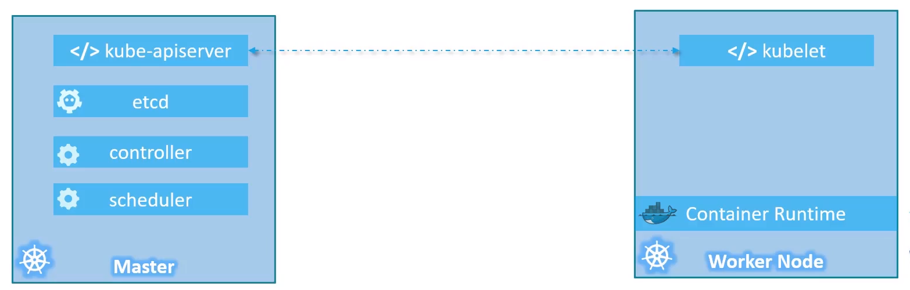
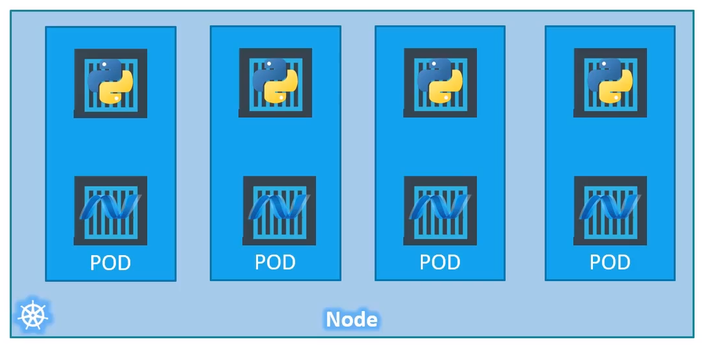

# Kubernetes

## Contents

- [Introduction](#introduction)
- [Containers vs Image](#containers-vs-image)
- [Container Orchestration](#container-orchestration)
- [Kubernetes Architecture](#kubernetes-architecture)
- [Setup](#set-up)
   * [Docker](#docker)
   * [Minikube and Kubectl](#minikube-and-kubectl)
- [Pods and Deployment](#pods-and-deployment)
- [YAML](#yaml)
-

## Introduction

- Container + Orchestration

### Containers

Most popular containerisation tool is Docker.

#### Why do we need containers?

Different services of a full stack application may have issues with different OS versions, libraries, dependencies or hardware infrastructures.

Docker contains each service with its respective library and dependencies. Theres provide completely isolated environments. E.g. microservices. Docker provides a high level tool to containerise these applications.

OS contains an OS kernel and software. The OS kernel can all be linux, the software is what makes the OS different. Different UI, dev tools, etc...

Docker containers share the underlying kernel. Docker can run any flavour of OS on top of the kernel. Each docker container contains the software which makes it able to run on other OS that have same base kernel.

Docker is not meant to be a VM, that can run other OS on others. 

#### Containers vs VMs

VMs contain the OS which is run on top of a Hypervisor on top of a different OS.

Docker installed on the OS, manages the containerised applications on top that rely on the same kernel.

This makes VMs much more intensive than containers.

### DockerHub

This is a platform that holds the related images to your OS. 

## Containers vs Image

A docker image is just the package, template or plan. These images are used to create docker containers based on the template.

```
Image = Application.war + Dockerfile
```

(.war is a web archive or packaged web application)

#### Dockerfile

Traditionally, a guide is given with an application package that describes the dependencies and how to set up the infrastructure. If issues occur, the client's developers will resolve it.

Now by defining a Dockerfile, it provides the setup, dependencies and infrastructure. Combining this with the packaged web application, this creates the image.

## Container Orchestration

When you have containers that may rely on others, (e.g. service container relying on database container) depending on load you may want more containers of your service being deployed via a Docker Host and how they are connected should be automated. 

The management of automatically scaling up or down based on load is called orchestration.

Kubernetes is a container orchestration technology. Alternatives include Docker Swarm, Kubernetes from Google and MESOS from Apache. Kubernetes is the most popular and provides complex customisation.

### Advantages of Container Orchestration

- Hardware failures do not bring your service down as the application has multiple instances on different nodes
- User traffic is load balanced, deploying more applications when needed
- Scales underlying nodes up and down
- Declared through objective oriented config files

## Kubernetes Architecture

#### Nodes

- worker machine where containers are launched. Can be physical or virtual. Also known as minions in the past

#### Cluster

- set of nodes so that if a node fails, the application can run on a different node
- multiple nodes also help managing load

#### Control-Plane (Master)

- is a node that is configured as a master
- watches over the nodes and is responsible for orchestration of the nodes

### Components

When Kubernetes is installed on a system, you are actuall installing the following componenets,

- API Server - front end for Kubernetes
- etcd - key-value store used by Kubernetes 
- kubelet - agent that runs on each node in the cluster, making sure containers are running on nodes as expected
- Container Runtime - underlying software that runs containers, in this case, Docker
- Controller - brains behind orchestration, makes decisions when nodes go down or load increases
- Scheduler - distributing work and containers across multiple nodes

### Control-Plane (Master) vs Worker Nodes



### Kubectl - Kube Control

Kubernetes command line tool, used to deploy and manage a Kubernetes cluster

```bash
kubectl run hello_world

kubectl cluster-info

kubectl get nodes
```

## Set Up

#### Local

- Minikube
- MicroK8s
- Kubeadm

#### Cloud

- Google Cloud Platform
- Amazon Web Services
- Microsoft Azure

As part of this course, they provide a cloud via,

- www.kodekloud.com

## Minikube

This local cluster provider bundles all the different components into a single image so that we can get started in a matter of minutes. The whole bundle is packaged into an ISO.

## Docker

A Docker daemon is a persistent background process that manages Docker images, containers, networks and storage volumes. Constantly listens for Docker API requests.

```bash
sudo docker run hello-world
```

Hello from Docker!
This message shows that your installation appears to be working correctly.

To generate this message, Docker took the following steps:
 1. The Docker client contacted the Docker daemon.
 2. The Docker daemon pulled the "hello-world" image from the Docker Hub.
    (amd64)
 3. The Docker daemon created a new container from that image which runs the
    executable that produces the output you are currently reading.
 4. The Docker daemon streamed that output to the Docker client, which sent it
    to your terminal.

## Minikube and Kubectl

Common commands - 

```bash
minikube start
minikube pause/unpause
minikube stop
minikube delete --all

minikube status

minikube config set memory [value]

minikube dashboard #starts kubernetes dashboard
```

```bash
kubectl get nodes

kubectl get po -A #checks cluster components
```

## Pods and Deployment

### Pods

A Kubernetes Pod is a group of one more Containers that are tied together for the purposes of administration and networking. Pods can be a collection of containerised applications or services (e.g. application container and helper container being part of the same pod which share the same network space). Scaling up and down is done through additional pod instances on the same node. If even more, then nodes would be expanded.



You can create a pod through,

```bash
kubectl run [name] --image=[image location] #the image is pulled from dockerhub
```

or create a deployment and pod using the image (shown below).

### Deployment

A Kubernetes Deployment checks on the health of the Pod and restarts the Pod's Container if it terminates. 

Deployments are recommended to manage creation and scaling of Pods via the dashboard.

#### Creating a Deployment

In order to create a deployment, the Docker image is required. The command below runs a test container image that includes a webserver

```bash
kubectl create deployment hello-node --image=registry.k8s.io/e2e-test-images/agnhost:2.39 -- /agnhost netexec --http-port=8080
```

Deployments and pods can then be monitored through useful commands,

```bash
kubectl get deployments/pods/events

kubectl describe pod [podname]

kubectl config view

kubectl logs [container name] #gets the logs for a container in a pod
```

### Service

By default, the Pod is only accessible by internal IP address within the Kubernetes cluster. To make the Container accessible from outside the Kubernetes virtual network, you have to expose the Pod as Service.

```bash
kubectl expose deployment hello-node --type=LoadBalancer --port=8080
```

The *--type=LoadBalancer* flag indicates that you want to expose your Service outside of the cluster.

The application code inside the test image only listens on TCP port 8080. Make sure that the image and port specified match.

After deployment, useful commands,

```bash
kubectl get services

minikube service hello-node #opens up the service in browser
minikube service hello-node --url #gets url
```

### Extras

Addons can be enabled,

```bash
minikube addons list

minikube addons enable metrics-server

kubectl get pod,svc -n kube-system #view pod and service created by installing metrics-server

kubectl top pods #checks outputs
```

### Clean Up

Clean up the resources created in the cluster,

```bash
kubectl delete service hello-node
kubectl delete deployment hello-node
```

```bash
minikube stop
```

## YAML

- This is a data format just like XML, JSON, Avro etc...
- This is used for configuration data

#### JSON example

```json
Servers: [
   {
      name: Server1,
      owner: John,
      created: 12232012,
      status: active,
   }
]
```

#### YAML version

```YAML
Servers:
   -  name: Server1
      owner: John
      created: 12232012
      status: active
```

### YAML Syntax

**Key Value Pair**

```yaml
Fruit: Apple
Vegetable: Carrot
Liquid: Water
Meat: Chicken
```

**Array/Lists**

```yaml
Fruits:
-  Orange
-  Apple
-  Banana

Vegetables:
-  Carrot
-  Cauliflower
-  Tomato
```

**Dictionary/ Map**

```yaml
Banana:
   Calories: 105
   Fat: 0.4 g
   Carbs: 27 g

Grapes:
   Calories: 62
   Fat: 0.3 g
   Carbs: 16 g
```

Can combine them all to make more advanced e.g. list of dictionaries

```yaml
-  Colour: Blue
   Model:
      Name: Corvette
      Year: 1995
   Transmission: Manual
   Price: 20000
-  Colour: Grey
   Model: 
      Name: Ford
      Year: 2002
   Transmission: Automatic
   Price: 30000
```

Note: Dictionary can be unordered and equal, array/lists that are unordered are not equal

## Creating a Pod with YAML in Kubernetes

The YAML file will always have 4 top level definitions:

- apiVersion 
- kind 
- metadata
- spec

These are required.

***pod-definition.yml***

```yaml
apiVersion: v1
kind: Pod
metadata:
   name: myapp_pod
   labels:
      app: myapp
      type: front-end
spec:
   containers:
      -  name: nginx-container
         image: nginx
```

#### apiVersion

Version of the Kubernetes API to create the object.

If it is a POD or Service kind, version v1. If ReplicaSet or Deployment, apps/v1.

#### kind

The kind of object. e.g. POD, Service, ReplicaSet Deployment

#### metadata

These include things like name, labels, etc... in the form of a dictionary

#### spec

This definition specifies the container or image we need in the Pod. This will be different for different objects. Refer to documentation for each type.

### Create the pod

```bash
kubectl create -f pod-definition.yml
```
