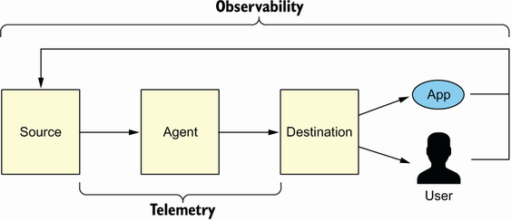
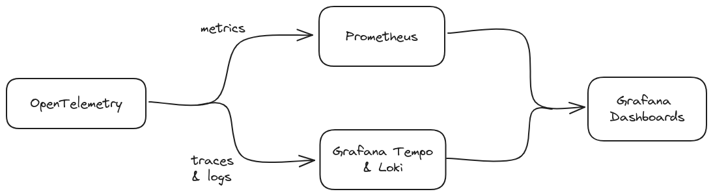
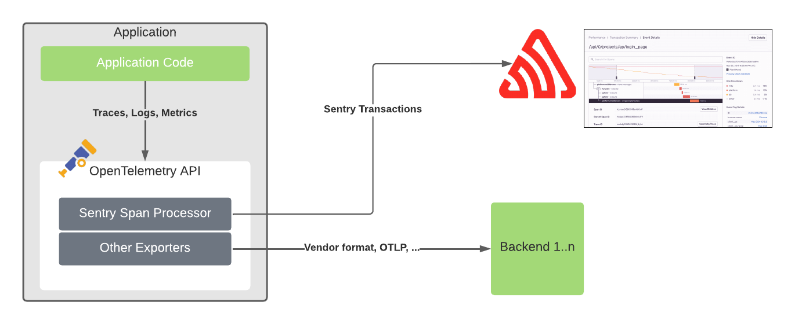

# Observability (telemetry + analysis)

## Modern Observability with OpenTelemetry

Traditionally logs, metrics and tracing is used for observability. These are the three pillars. 

In essence all of these are used together. E.g. if a metric goes wrong, you go into logs or data to investigate the problem.

Modern observability with OpenTelemetry is breaking down the three pillars and combining them together from scratch.

### Starting from Scratch

1. We start with an event (a timestamp and a collection of attributes)

E.g. HTTP server events

*GET/account/123/project/abc*

- connection events
- request events
- response events
- etc

What attributes do they have?

#### Unique Attributes

Some of these attributes are unique to the event 

- timestamp
- description

#### Resource Attributes

Good chunk are resource attributes (static context). These are all the resources associated with the event.

- service name
- service ID
- service version
- library name
- library version
- region

#### Operation Attributes

- request start time
- request duration
- HTTP method
- HTTP path
- account ID
- project ID

Others are operation attributes (dynamic context) that are unique to the operation itself.

### Causality

We want to put these events into a graph. We can do this through adding causality attributes.

These four attributes are:

- Trace ID: represents overall transaction that these events are occuring in
- Span ID: represents operations that these events occur in
- Parent Span ID: operation that caused this operation
- Operation Name: stable name for comparison of multiple runs with same operation

This turns our events into tracers! The benefits is that it can be easier to find the logs that you want.

## Events in Aggregates

We want to monitor aggregates like latency or number of errors.

This is what we call metrics. But we want to find the cause of these errors. We don't just want high latency, we want to know where it is occuring or where there is an increased error rate. This observability helps us find the root cause of the problem.

Correlations may occur between events in a trace, between many traces etc...

If the pillars are separate it is difficult to connect metrics with logs. 

***Instead*** aggregates (metrics) need to be built from trace data.

Data structures that enable automated analysis.

## What is OpenTelemetry?

Is data structures which enable automated analysis. Provides:

- Traces - context for what happened
- Resources - context for where it happened
- Metrics - attached to tracers by exemplars
- Logs - attached to traces as events

The API's look separate but are automatically connected together, which means when metrics are provided, tracers and resources are connected.

OTLP - protocol that streams data to a single analysis tool. Modern analysis uses all of this data together.

#### Key Terms

- Transactions - requests that orchestrate and utilise the resources. Usually kicked off by a human e.g. loading web page, booking a flight

- User telemetry - data about how a user is interacting with a system through a client. e.g. button clicks, session duration etc...

- Performance telemetry - provides operators with statistical information about the behaviour and peformance of system components

## General Observability Overview

Core concepts:

- System Under Observation (SUO) - cloud-native platform you care about
- Signals - logs, metrics, traces, etc...
- Sources - part of the infrastructure and application layer
- Agents - responsible for signal collection, processing and routing e.g. OpenTelemetry
- Destinations - where the signals are consumed. e.g. backend storage and front end visualisation
- Telemetry - process of collecting signals from sources, routing or preprocessing via agents and ingestion to destinations
- Instrumentation - code that emites telemetry data within the programs themselves
- Transmission system - for sending the data over the network to an alaysis tool where observing occurs

## Examples of Destinations

#### Grafana and Prometheus

- Prometheus is an open source monitoring system, collecting metrics and providing querying language and storage backend for the data
- Grafana provides out of the box support, focusing on data visualisation

#### SigNoz

- All in one, offering software and cloud storage of signals
- Easy to set up but less documentation compared to others

#### Uptrace

- Less mature than SigNoz but has similar positioning and architecture
- Live demo available

### Commercial Offerings

These are usually more of an investment due to their handling of stability. Open source requires more technical expertise to maintain.

#### Honeycomb

- Cloud native SaaS with unique capabilities for investigating anomalies
- Strong focus on manaul instrumentation
- Founders established observability (o11y) moniker
- Can handle a large number of distinct attributes or dimensions

#### NewRelic

- Positions itself for DevOps, securiy and business
- Dedicated workflows for notifications when events are triggered

#### Sentry

